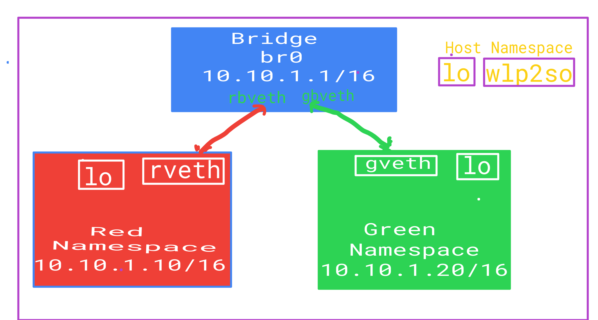

# learn Linux Networking and Docker - Bridge, Virtual Ethernet and IPTables

## Network Namespaces

A namespace is a way of scoping a particular set of identifiers. Using a namespace, you can use the same identifier multiple times in different namespaces. Using network namespaces, you can create separate network interfaces and routing tables that are isolated from the rest of the system and operate independently.

To understand namespaces easily, it is worth saying Linux namespaces are the basis of container technologies like Docker or Kubernetes.

Let's create one quickly.

ip netns add ns1

Now  isolated network namespace is ns1 you created just. Now you can go ahead and run any process inside this namespace. Let's create python server inside ns1. This means that the process runs within its own network stack, separate from the host, and can communicate only through the interfaces defined in the network namespace.

 ip netns exec ns1 python3 -m http.server 8000

## Create two network namespace

    ip netns add red
    ip netns add green

## Create Veth( Virtual Ethernet) and Connect to network namespace

    ip link add rveth type veth peer name rbveth
    ip link add gveth type veth peer name gbveth

Think of VETH like a network cable.One end is attached to the host network, and the other end to the network namespace created. Let's go ahead and connect the cable, and bring these interfaces up.

## Connect cable to namespace

    ip link set rveth netns red
    ip link set gveth netns green

##  setup veth link
    ip link set rbveth up
    ip link set gbveth up

## setup loopback interface

    ip netns exec red ip link set lo up
    ip netns exec green ip link set lo up

the loopback interface directs the traffic to remain within the local system. So when you run something on localhost (127.0.0.1), you are essentially using the loopback interface to route the traffic through.

## setup  namespace interface
    ip netns exec red ip link set rveth up
    ip netns exec green ip link set gveth up

## assign ip address to namespace interfaces

    ip netns exec red ip addr add 10.10.1.10/16 dev rveth
    ip netns exec green ip addr add 10.10.1.20/16 dev gveth

## Build Bridges

A bridge is a way to connect two Ethernet segments together in a protocol independent way.

Docker has a docker0 bridge underneath to direct traffic. When Docker service starts, a Linux bridge is created on the host machine. The various interfaces on the containers talk to the bridge, and the bridge proxies to the external world. Multiple containers on the same host can talk to each other through the Linux bridge.

## create bride

    ip link add br0 type bridge

## setup bridge

    ip link set br0 up

# assign veth pairs to bridge

    ip link set rbveth master br0
    ip link set gbveth master br0

# setup bridge ip

    ip addr add 10.10.1.1/16 dev br0

Since we have the VETH pairs connected to the bridge, the bridge network address is available to these network namespaces. Let's add a default route to direct the traffic to the bridge

## add default routes for ns
    ip netns exec red ip route add default via 10.10.1.1
    ip netns exec green ip route add default via 10.10.1.1

## Done. Let's finally interact with the namespaces.

    ip netns exec red ping 10.10.1.20

## MASQUERADE

We are able to send traffic between the namespaces, but if try to send traffic outside of namespace it will fail. And for that, we'd need to use IPTables to masquerade the outgoing traffic from our namespace.

##  enable ip forwarding
    bash -c 'echo 1 > /proc/sys/net/ipv4/ip_forward'

    iptables -t nat -A POSTROUTING -s 10.10.1.10/16 ! -o br0 -j MASQUERADE

MASQUERADE modifies the source address of the packet, replacing it with the address of a specified network interface. and  it does not require the machine's IP address to be known in advance.

## How does Docker work?

Each Docker container has its own network stack, where a new network namespace is created for each container, isolated from other containers. When a Docker container launches, the Docker engine assigns it a network interface with an IP address, a default gateway, and other components, such as a routing table and DNS services

Docker allows you to create three different types of network drivers. All these network types are configured through docker0 via the --net flag

This is the default. Whenever you start Docker, a bridge network gets created and all newly started containers will connect automatically to the default bridge network.

### 1. Host Networking (--net=host): The container shares the same network namespace of the default host.

As the name suggests, host drivers use the networking provided by the host machine. And it removes network isolation between the container and the host machine where Docker is running. For example, If you run a container that binds to port 80 and uses host networking, the container’s application is available on port 80 on the host’s IP address. You can use the host network if you don’t want to rely on Docker’s networking but instead rely on the host machine networking.

One limitation with the host driver is that it doesn’t work on Docker desktop: you need a Linux host to use it. This article focuses on Docker desktop, but I’ll show you the commands required to work with the Linux host.

The following command will start an Nginx image and listen to port 80 on the host machine:

# ## check the network interfaces on the host
    ip addr

###  check the network interfaces in the container

    docker run --net=host -it --rm alpine ip addr

### 2. Bridge Networking (--net=bridge/default)

You can use this whenever you want your containers running in isolation to connect and communicate with each other. Since containers run in isolation, the bridge network solves the port conflict problem. Containers running in the same bridge network can communicate with each other, and Docker uses iptables on the host machine to prevent access outside of the bridge

### Check the available network by running the  command

docker network ls

#####  check the network interfaces in the container

    docker run --net=bridge -it --rm alpine ip addr

### 3. Overlay driver 

The Overlay driver is for multi-host network communication, as with Docker Swarm or Kubernetes. It allows containers across the host to communicate with each other without worrying about the setup. Think of an overlay network as a distributed virtualized network that’s built on top of an existing computer network.

To create an overlay network for Docker Swarm services, use the following command:

### docker network create -d overlay my-overlay-network
 

### 4. Macvlan driver: 

“Macvlan networks allow you to assign a MAC address to a container, making it appear as a physical device on your network. The Docker daemon routes traffic to containers by their MAC addresses. Using the macvlan driver is sometimes the best choice when dealing with legacy applications that expect to be directly connected to the physical network, rather than routed through the Docker host’s network stack.”

### 5. No networking: This option disables all networking for the container

    docker run --net=none alpine ip addr